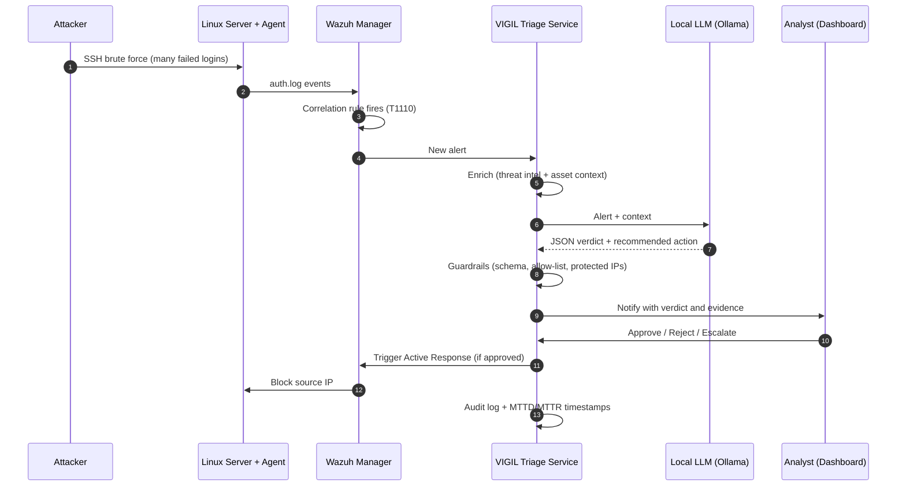
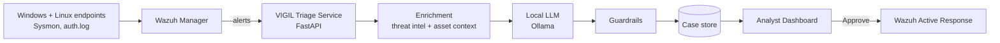

<div align="center">

# VIGIL

### AI-assisted SOC triage with a human in the loop

**Detect. Triage. Approve. Respond.**


-black)


</div>

> Graduation project for the **Cyber Security Incident Response Analyst** track.
> Educational lab project: every attack runs in an isolated environment we own.

---

## The Problem

Security Operations Centers drown in alerts. Most of them are noise, but the few
that matter wait in the same queue. Manual first-pass triage is:

- **Slow**: every alert needs context gathering before a decision can be made.
- **Inconsistent**: two analysts can classify the same alert differently.
- **Exhausting**: alert fatigue leads to missed incidents and burnout.

The result is a longer **Mean Time To Detect (MTTD)** and **Mean Time To Respond (MTTR)**.

## The Solution

VIGIL is a small, fully local SOC pipeline where a **locally hosted LLM performs
the first-pass triage** and a **human analyst makes every final decision**.

- Wazuh detects the attack and raises an alert.
- VIGIL enriches the alert with threat-intel and asset context.
- A local LLM (via Ollama) returns a structured verdict: *is it real, how severe, which MITRE ATT&CK technique, what should we do*.
- The analyst reviews the verdict with its evidence and clicks **Approve**, **Reject** or **Escalate**.
- Approved actions run through Wazuh Active Response, and everything is audited.

> **Core principle: the AI recommends, the human decides.**
> No alert data leaves the lab, and the AI can never execute an action on its own.

We also **measure** how well it works: precision, recall and F1 across several
local models, plus the time saved per alert.

---

## How It Works: from attack to response

**Scenario: SSH brute-force attack against a lab Linux server**

| # | Actor | What happens |
|---|-------|--------------|
| 1 | Attacker | Launches an SSH brute-force attack (e.g. Hydra or Atomic Red Team) against the lab server. |
| 2 | Linux server | Failed logins are written to `auth.log`; the Wazuh agent forwards them to the manager. |
| 3 | Wazuh | A correlation rule fires after repeated failures from one source IP (MITRE **T1110**) and raises an alert. |
| 4 | VIGIL | The triage service ingests the new alert. |
| 5 | VIGIL | **Enrichment**: threat-intel lookup on the source IP and asset context (how critical is the target?). |
| 6 | Local LLM | Returns a structured **JSON verdict**: classification, severity, ATT&CK technique, evidence, recommended action, confidence. |
| 7 | Guardrails | Validate the output: strict schema, allow-listed actions, protected IPs. Invalid output is flagged for a human, never silently accepted. |
| 8 | Analyst | Gets notified, opens the dashboard and sees the alert **together with the AI verdict and its evidence**. |
| 9 | Analyst | Decides: **Approve**, **Reject** or **Escalate**. |
| 10 | Wazuh | On approval, Active Response blocks the source IP for a limited time. |
| 11 | VIGIL | Every step is written to the audit log; timestamps feed the MTTD / MTTR metrics. |



### Example AI verdict

```json
{
  "verdict": "true_positive",
  "severity": "high",
  "attack_technique": "T1110",
  "summary": "Repeated SSH authentication failures from a single source IP.",
  "evidence": ["rule.id=100100", "data.srcip=<attacker-ip>", "failed_attempts=8 in 120s"],
  "recommended_action": "block_ip",
  "confidence": 0.9
}
```

---

## Architecture



## Safety and Guardrails

- **Advisory only**: the LLM never executes anything.
- **Strict schema**: output is validated; invalid output is counted as a *format failure*.
- **Action allow-list**: `block_ip`, `isolate_host`, `escalate`, `none`.
- **Human approval** required for every blocking or isolating action.
- **Protected networks** (team machines, gateways) can never be blocked.
- **Full audit trail**: raw alert, prompt, model, output, decision and approver.
- **Local only**: no alert data or secrets leave the lab.

## Evaluation

| Metric | How we measure it | Result |
|---|---|---|
| Triage accuracy | Precision / recall / F1 vs. a hand-labeled alert dataset | _TBD_ |
| Model comparison | Three local models, same alerts, same prompt | _TBD_ |
| Reliability | Format-failure and hallucination rate | _TBD_ |
| Speed | Analyst time per alert, with and without AI | _TBD_ |
| SOC KPIs | MTTD / MTTR from recorded timestamps | _TBD_ |

## Tech Stack

`Wazuh` · `Sysmon` · `Atomic Red Team` · `Python` · `FastAPI` · `Pydantic` · `SQLite` · `Ollama`

## Planned Repository Structure

> This repository starts minimal and grows week by week.

```
docs/         architecture, setup guides, weekly deliverables
infra/        Wazuh and Sysmon configuration
attacks/      attack test plan and benign-noise generators
detection/    custom detection rules and ATT&CK mapping
triage-service/  API, guardrails, prompts
dashboard/    analyst dashboard
evaluation/   labeled dataset, benchmark scripts, results
reports/      incident report, executive brief, chain of custody
```

## Roadmap

- [ ] **Week 1**: lab build, agents connected, baseline and resource usage
- [ ] **Week 2**: attack simulation, labeled alert dataset, custom detection rules
- [ ] **Week 3**: triage pipeline, analyst dashboard, approval and response
- [ ] **Week 4**: model benchmark, MTTD/MTTR measurements, final IR report and demo

## Team

| Name | Role | GitHub |
|---|---|---|
|  | AI / Automation Engineer |  |
|  | SIEM / Infrastructure Engineer |  |
|  | Attack / Endpoint Engineer |  |
|  | Detection Engineer |  |
|  | Incident Response and Reporting |  |

## Disclaimer

For educational use in isolated lab environments only. Do not run any attack
technique against systems you do not own.

## License

Released under the [MIT License](LICENSE).
