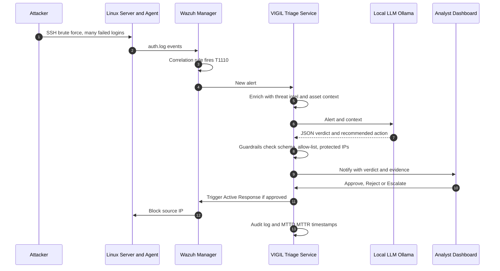
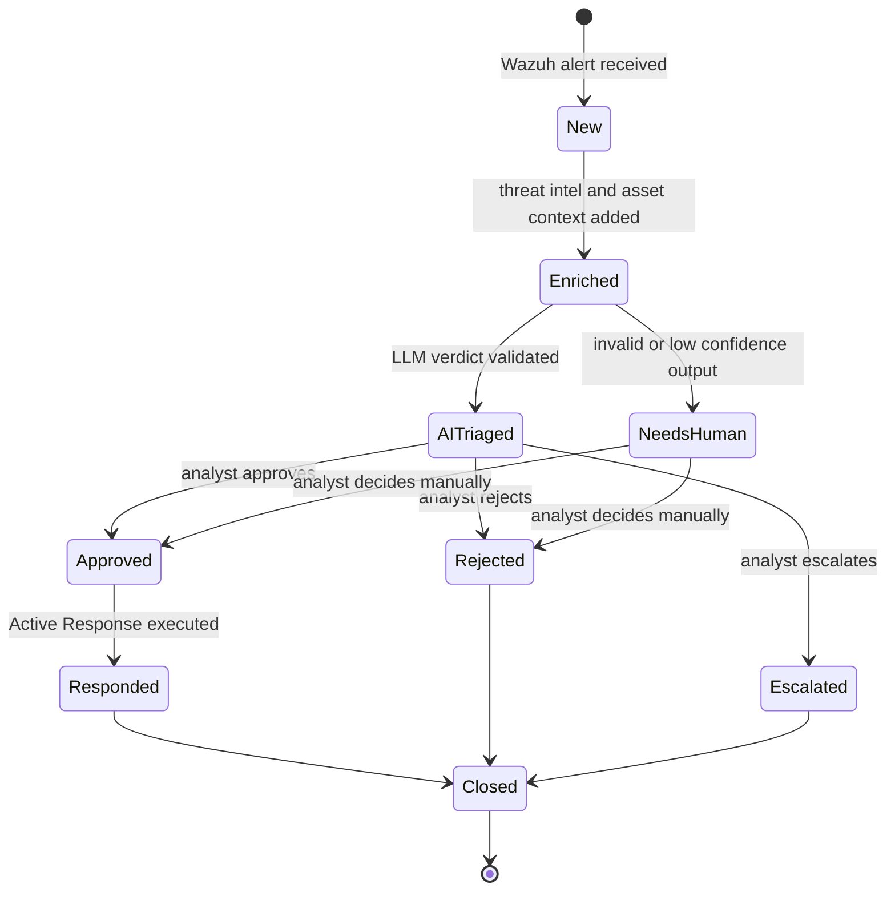
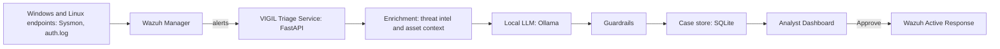

<div align="center">

# VIGIL

### AI-assisted SOC triage with a human in the loop

**Detect. Triage. Approve. Respond.**


-black)


</div>

> Graduation project for the **Cyber Security Incident Response Analyst** track.
> Educational lab project: every attack runs in an isolated environment we own.

---

## Table of Contents

- [What is VIGIL?](#what-is-vigil)
- [The Problem](#the-problem)
- [The Solution](#the-solution)
- [How It Works: from attack to response](#how-it-works-from-attack-to-response)
- [What the analyst sees](#what-the-analyst-sees)
- [Case lifecycle](#case-lifecycle)
- [Architecture](#architecture)
- [How the AI is used](#how-the-ai-is-used)
- [Safety and Guardrails](#safety-and-guardrails)
- [Detection example](#detection-example)
- [Evaluation](#evaluation)
- [Tech Stack and Lab Requirements](#tech-stack-and-lab-requirements)
- [Planned Repository Structure](#planned-repository-structure)
- [Roadmap](#roadmap)
- [FAQ](#faq)
- [Glossary](#glossary)
- [Team](#team)

---

## What is VIGIL?

**VIGIL reads security alerts so analysts don't have to read every one from scratch.**

When an attack is detected, a local AI model reads the alert, explains what is
happening, and recommends what to do. A human analyst reviews the recommendation
and makes the final call. **Nothing is blocked or changed without approval.**

### In 30 seconds

1. Someone tries to guess an SSH password thousands of times (a brute-force attack).
2. **Wazuh** detects it and raises an alert.
3. **VIGIL** sends the alert to a local AI model and asks: *Is this real? How serious? What should we do?*
4. The AI answers: *"Real brute-force attack, high severity, block the source IP."*
5. **You** open the dashboard, see the AI's answer together with the evidence, and click **Approve**.
6. The attacker's IP is blocked, and every step is recorded in an audit log.

```text
 [1] ATTACK        SSH brute force against the lab server
        |
        v
 [2] DETECT        Wazuh correlation rule fires -> alert
        |
        v
 [3] AI TRIAGE     Local LLM returns a structured JSON verdict
        |
        v
 [4] GUARDRAILS    Schema check - action allow-list - protected IPs
        |
        v
 [5] ANALYST       Reviews verdict + evidence: Approve / Reject / Escalate
        |          <-- HUMAN DECIDES
        v
 [6] RESPOND       Wazuh Active Response blocks the source IP
                   Everything is written to the audit log
```

---

## The Problem

Security Operations Centers drown in alerts. Most of them are noise, but the few
that matter wait in the same queue. Manual first-pass triage is:

- **Slow**: every alert needs context gathering before a decision can be made.
- **Inconsistent**: two analysts can classify the same alert differently.
- **Exhausting**: alert fatigue leads to missed incidents and burnout.

The result is a longer **Mean Time To Detect (MTTD)** and **Mean Time To Respond (MTTR)**.

| Without VIGIL | With VIGIL |
|---|---|
| The analyst reads each raw alert and gathers context by hand | The alert arrives already analyzed, with a verdict and evidence |
| Triage is slow and varies between analysts | The AI gives a consistent first-pass opinion |
| Real attacks can wait behind noisy alerts | Alerts are classified and prioritized by severity |
| No measurement of triage quality | Accuracy and time saved are measured and reported |

## The Solution

VIGIL is a small, fully local SOC pipeline where a **locally hosted LLM performs
the first-pass triage** and a **human analyst makes every final decision**.

- Wazuh detects the attack and raises an alert.
- VIGIL enriches the alert with threat-intel and asset context.
- A local LLM (via Ollama) returns a structured verdict: *is it real, how severe, which MITRE ATT&CK technique, what should we do*.
- The analyst reviews the verdict with its evidence and clicks **Approve**, **Reject** or **Escalate**.
- Approved actions run through Wazuh Active Response, and everything is audited.

> **Core principle: the AI recommends, the human decides.**
> No alert data leaves the lab, and the AI can never execute an action on its own.

We also **measure** how well it works: precision, recall and F1 across several
local models, plus the time saved per alert.

---

## How It Works: from attack to response

**Scenario: SSH brute-force attack against a lab Linux server**

| # | Actor | What happens |
|---|-------|--------------|
| 1 | Attacker | Launches an SSH brute-force attack (e.g. Hydra or Atomic Red Team) against the lab server. |
| 2 | Linux server | Failed logins are written to `auth.log`; the Wazuh agent forwards them to the manager. |
| 3 | Wazuh | A correlation rule fires after repeated failures from one source IP (MITRE **T1110**) and raises an alert. |
| 4 | VIGIL | The triage service ingests the new alert. |
| 5 | VIGIL | **Enrichment**: threat-intel lookup on the source IP and asset context (how critical is the target?). |
| 6 | Local LLM | Returns a structured **JSON verdict**: classification, severity, ATT&CK technique, evidence, recommended action, confidence. |
| 7 | Guardrails | Validate the output: strict schema, allow-listed actions, protected IPs. Invalid output is flagged for a human, never silently accepted. |
| 8 | Analyst | Gets notified, opens the dashboard and sees the alert **together with the AI verdict and its evidence**. |
| 9 | Analyst | Decides: **Approve**, **Reject** or **Escalate**. |
| 10 | Wazuh | On approval, Active Response blocks the source IP for a limited time. |
| 11 | VIGIL | Every step is written to the audit log; timestamps feed the MTTD / MTTR metrics. |



### Example AI verdict

```json
{
  "verdict": "true_positive",
  "severity": "high",
  "attack_technique": "T1110",
  "summary": "Repeated SSH authentication failures from a single source IP.",
  "evidence": ["rule.id=100100", "data.srcip=<attacker-ip>", "failed_attempts=8 in 120s"],
  "recommended_action": "block_ip",
  "confidence": 0.9
}
```

---

## What the analyst sees

> Illustrative mock-up of the planned analyst view.

```text
+------------------------------------------------------------------+
| ALERT #1042    SSH brute force                  <date> <time> UTC |
| Source: <attacker-ip>   Target: linux-srv-01   Rule: 100100       |
+------------------------------------------------------------------+
| AI VERDICT    TRUE POSITIVE     Severity: HIGH    Confidence: 0.90|
| ATT&CK        T1110  Brute Force                                  |
| Summary       Repeated SSH failures from a single source IP.      |
| Evidence      8 failed logins in 120s, rule.id=100100             |
| Recommended   BLOCK IP                                            |
+------------------------------------------------------------------+
|        [ Approve ]        [ Reject ]        [ Escalate ]          |
+------------------------------------------------------------------+
```

## Case lifecycle

Every alert becomes a case that moves through clear states, and every transition is logged.



---

## Architecture



| Component | Role | Runs on |
|---|---|---|
| Wazuh manager + agents | Detection, alerts, active response | SIEM machine + endpoints |
| Triage service (FastAPI) | Ingest, enrich, call the LLM, apply guardrails | AI machine |
| Ollama | Local LLM inference | AI machine |
| Case store (SQLite) | Cases, verdicts, decisions, audit log | AI machine |
| Analyst dashboard | Review and approve | AI machine |

If team machines are on different networks, they are joined with a private overlay
VPN. No Wazuh port is exposed to the internet.

## How the AI is used

- The model receives **only** the alert and its enrichment, never secrets.
- The prompt forces **one JSON object** with a fixed set of keys.
- `temperature = 0` for repeatable output.
- If the alert does not contain enough information, the correct answer is `needs_human`.
- Prompts are versioned in the repository so results stay reproducible.

## Safety and Guardrails

- **Advisory only**: the LLM never executes anything.
- **Strict schema**: output is validated; invalid output is counted as a *format failure*.
- **Action allow-list**: `block_ip`, `isolate_host`, `escalate`, `none`.
- **Human approval** required for every blocking or isolating action.
- **Protected networks** (team machines, gateways) can never be blocked.
- **Full audit trail**: raw alert, prompt version, model, output, decision, approver and timestamps.
- **Local only**: no alert data or secrets leave the lab.
- **Hallucination log**: every wrong claim found during validation is recorded.

## Detection example

An example custom Wazuh rule used in the lab (validated with `wazuh-logtest` before use):

```xml
<rule id="100100" level="10" frequency="8" timeframe="120">
  <if_matched_sid>5760</if_matched_sid>
  <same_source_ip />
  <description>Multiple SSH authentication failures from the same source IP</description>
  <mitre><id>T1110</id></mitre>
</rule>
```

Meaning: 8 failed SSH logins from the same IP within 120 seconds raise a high-severity alert mapped to MITRE ATT&CK **T1110 (Brute Force)**.

---

## Evaluation

| Metric | How we measure it | Result |
|---|---|---|
| Triage accuracy | Precision, recall and F1 against a hand-labeled alert dataset (two independent labelers) | _TBD_ |
| Model comparison | Three local models, same alerts, same prompt, `temperature = 0` | _TBD_ |
| Reliability | Format-failure rate and hallucination rate | _TBD_ |
| Speed | Analyst time per alert, with and without AI, on the same cases | _TBD_ |
| SOC KPIs | MTTD and MTTR computed from recorded timestamps | _TBD_ |

Models planned for the benchmark: two 3B-class models (live demo) and one 7B-class model (batch run).

## Tech Stack and Lab Requirements

`Wazuh` · `Sysmon` · `Atomic Red Team` · `Python` · `FastAPI` · `Pydantic` · `SQLite` · `Ollama`

| Item | Guideline |
|---|---|
| Wazuh server | roughly 8 GB RAM for a small lab (check the official docs) |
| 3B models | run on 8 GB RAM machines |
| 7B to 8B models | need about 16 GB RAM |
| GPU | optional; it speeds up inference |

## Planned Repository Structure

> This repository starts minimal and grows week by week.

```text
docs/            architecture, setup guides, weekly deliverables
infra/           Wazuh and Sysmon configuration
attacks/         attack test plan and benign-noise generators
detection/       custom detection rules and ATT&CK mapping
triage-service/  API, guardrails, prompts
dashboard/       analyst dashboard
evaluation/      labeled dataset, benchmark scripts, results
reports/         incident report, executive brief, chain of custody
```

## Roadmap

- [ ] **Week 1**: lab build, agents connected, baseline and resource usage
- [ ] **Week 2**: attack simulation, labeled alert dataset, custom detection rules
- [ ] **Week 3**: triage pipeline, analyst dashboard, approval and response
- [ ] **Week 4**: model benchmark, MTTD/MTTR measurements, final incident report and demo

---

## FAQ

**Why a local LLM instead of a cloud one?**
Alerts contain internal IPs, usernames and hostnames. Keeping inference local means no sensitive data leaves the lab, and it works offline.

**Why does a human approve every action?**
Language models can be wrong. Blocking the wrong IP or isolating the wrong host has a real cost, so the AI only recommends and the analyst decides.

**What if the AI is wrong?**
That is exactly what we measure. Wrong or invented answers are logged, counted in the benchmark, and invalid output is never accepted automatically.

**Is this a production product?**
No. It is an educational lab project that demonstrates and measures the idea.

## Glossary

| Term | Meaning |
|---|---|
| SOC | Security Operations Center: the team that monitors and responds to threats |
| SIEM | System that collects logs and raises alerts (here: Wazuh) |
| Alert | A warning raised by a detection rule |
| Triage | First review of an alert: is it real, how serious, what next |
| True / False positive | A real attack / a harmless event that looked suspicious |
| Brute force | Guessing passwords by trying many combinations |
| MITRE ATT&CK | Public catalog of attacker techniques (e.g. T1110) |
| MTTD / MTTR | Mean time to detect / to respond |
| Active Response | Wazuh feature that runs an action, such as blocking an IP |
| LLM | Large language model, the AI that reads and summarizes alerts |
| Guardrails | Rules that limit and validate what the AI can output or trigger |

## Team

| Name | Role | GitHub |
|---|---|---|
|  | AI / Automation Engineer |  |
|  | SIEM / Infrastructure Engineer |  |
|  | Attack / Endpoint Engineer |  |
|  | Detection Engineer |  |
|  | Incident Response and Reporting |  |

## Disclaimer

For educational use in isolated lab environments only. Do not run any attack
technique against systems you do not own.

## License

Released under the [MIT License](LICENSE).
